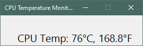
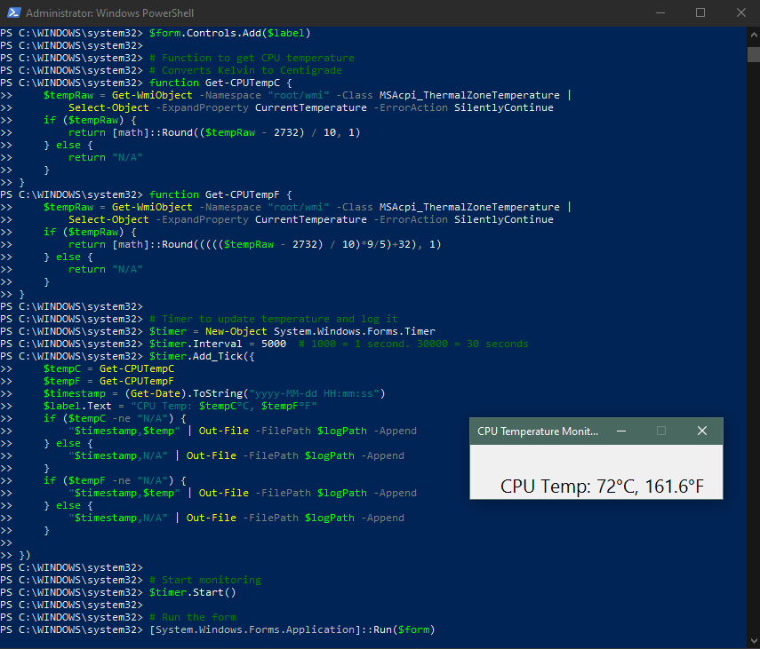

# CPU Temperature Display Script

This PowerShell script monitors your CPU temperature in real-time using a simple graphical display. It updates every 30 seconds and logs temperature data to a daily CSV file.



## Features

- Displays current CPU temperature in a small window (°C & °F)
- Updates every 30 seconds (configurable)
- Logs data to a daily CSV file (e.g. `temperature_log_2025-07-15.csv`)

## Latest Changes

### Added comment block

- Synopsis - A brief description of what the script does
- Description - A more detailed explanation of the script's functionality
- Notes - Contains metadata about the script:
  - Version number
  - Author name
  - Creation date
  - Last modified date
    -Change log with version history

### Added a configuration hashtable - Makes it easy to adjust settings in one place

- Update interval (Set to desired seconds, 1000 = 1 second.)
- Log file path
- Option to display Fahrenheit

### Fixed logging issues

- Created a dedicated Write-TempLog function
- Fixed the variable name bug introduced when adding °F (was using $temp instead of $tempC/$tempF)
- Now logs both Celsius and Fahrenheit in a single line
- Eliminated redundant logging code

### Fixed Form / Timer handling issues

- Added a FormClosed event handler to properly terminate the Form and the timer.
  The timer previouly continued to run in the PowerShell instance and running the script again resulted in two timers triggering additional temperature checks and logging. Closing PowerShell did end the timers, but it's better to clean up resources properly.

### Improved UI

- Added option to show both temperature units
- Organized UI creation code into a logical section

### Better code organization

- Grouped related functionality
- Improved readability with consistent spacing and formatting
- Removed commented-out code

## TODO - Features to add in future version

- Tidy up the threshold setting. Allow user to enter actual seconds - do the x1000 elsewhere.
- Add a toggle to choose which temp to display
- Prettier display
- Automatically delete log files older than 7 days
- Allow user to set delete interval
- Optional red warning text if temperature exceeds preset threshold
- Allow user to set threshold temp
- Pop-up warning when critical heat is reached - _CAUTION! Need to ensure only one pop-up allowed at a time_
- Check CPU type and lookup manufacturer recommended max temp - how? where?
- Auto minimise the PowerShell window on script run
- Auto restart in Administrator mode if run in user mode
- Auto launch PowerShell in administrator mode - Error in normal mode: `Get-WmiObject : Access denied`
  - Auto launch PowerShell in minimised administrator mode - requires previous step

## Requirements

- Windows (with WMI access) - _Run in Administrator Mode_
- PowerShell 5.x or newer
- .NET Windows Forms (built-in on most Windows systems)
- Visual Studio Code (recommended) with the PowerShell extension

## Usage

1. Clone this repository:
   ```bash
   git clone https://github.com/MichaelMcKibbin/cpu_temp_display
   ```

## The script in action

### Version 1.0


### Version 1.1


