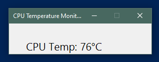
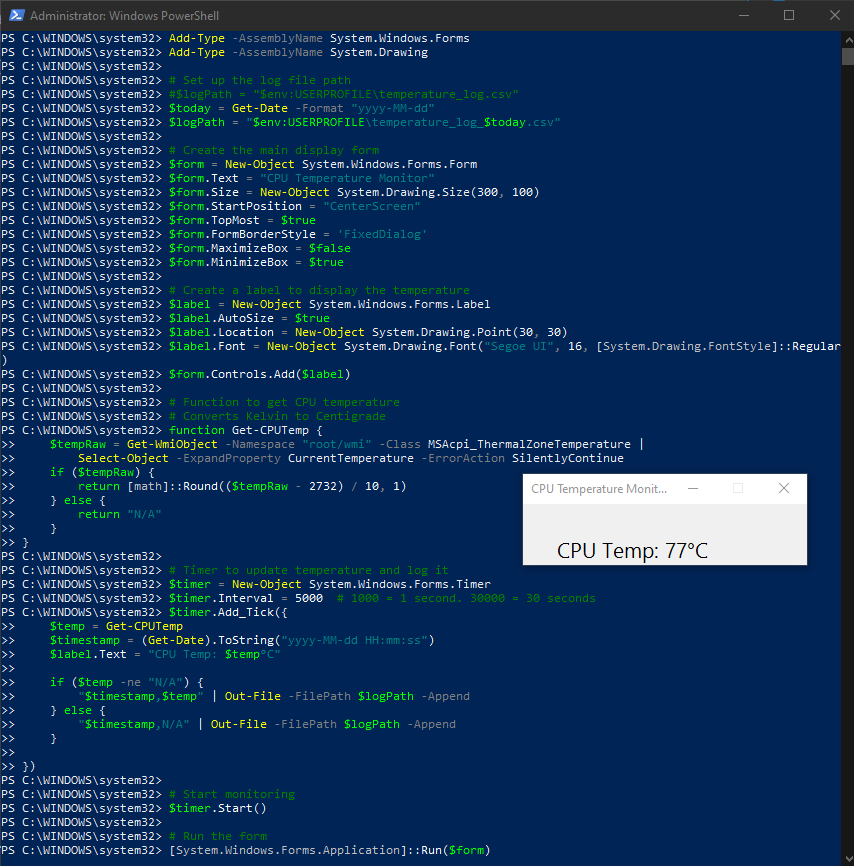

# CPU Temperature Display Script

This PowerShell script monitors your CPU temperature in real-time using a simple graphical display. It updates every 30 seconds and logs temperature data to a daily CSV file.



## Features

- Displays current CPU temperature in a small window
- Updates every 30 seconds (configurable)
- Logs data to a daily CSV file (e.g. `temperature_log_2025-07-15.csv`)

## TODO - Features to add in future version

- Automatically delete log files older than 7 days
- Optional red warning text if temperature exceeds preset threshold
- Auto minimise the PowerShell window
- Auto restart in Administrator mode if run in user mode

## Requirements

- Windows (with WMI access)
- PowerShell 5.x or newer
- .NET Windows Forms (built-in on most Windows systems)
- Visual Studio Code (recommended) with the PowerShell extension

## Usage

1. Clone this repository:
   ```bash
   git clone https://github.com/MichaelMcKibbin/cpu_temp_display
   ```

## The script in action


